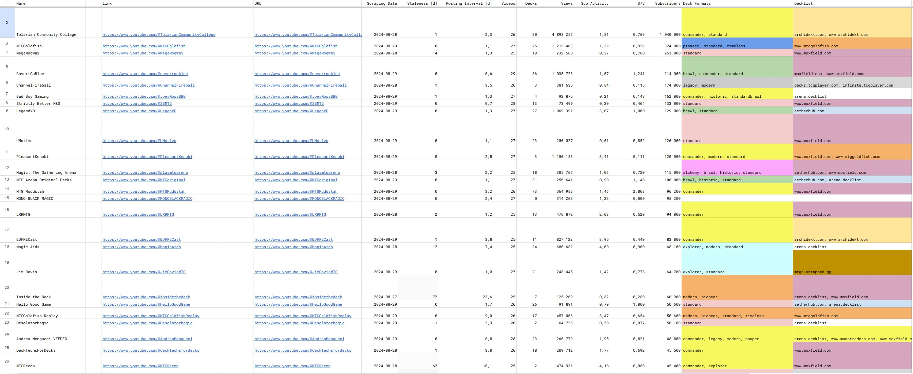

# mtg
Scrape data on MtG decks.

### Description

This is a hobby project.

It started as a card data scraping from `MTG Goldfish`. Then, some JumpIn! packets info scraping 
was added. Then, there was some play with Limited data from [17lands](https://www.17lands.com) when 
I thought I had to bear with utter boringness of that format (before the dawn of Golden Packs on 
Arena) [_This part has been deprecated and moved to [archive](https://github.com/z33kz33k/mtg/tree/2d5eb0c758953d38ac51840ed3e49c2c25b4fe91/mtgcards/archive) package_]. Then, I discovered I 
don't need to scrape anything because [Scryfall](https://scryfall.com).

Then, I quit (Arena).

Now, the main focus is `deck` and `yt` packages (parsing data on youtubers' decks from 
YT videos descriptions).

### What works

* Scryfall data management via downloading bulk data with 
  [scrython](https://github.com/NandaScott/Scrython) and wrapping it in convenient abstractions
* Scraping YouTube channels for decklist-featuring video descriptions (or author's comments) - using 
  no less than four Python libraries to avoid bothering with Google APIs: 
    * [scrapetube](https://github.com/dermasmid/scrapetube),
    * [pytubefix](https://github.com/JuanBindez/pytubefix),
    * [youtubesearchpython](https://github.com/alexmercerind/youtube-search-python), 
    * [youtube-comment-downloader](https://github.com/egbertbouman/youtube-comment-downloader) 
* Parsing those descriptions (or author's comments) for decks:    
    * Pasted text decklists in Arena/MTGO format are parsed into Deck objects
    * Links to decklist sites are scraped into Deck objects. 43 sites are supported so far:
        * [17Lands](https://www.17lands.com)
        * [Aetherhub](https://aetherhub.com)
        * [Archidekt](https://archidekt.com)
        * [CardBoard Live](https://cardboard.live)
        * [Cardhoarder](https://www.cardhoarder.com)
        * [Cardsrealm](https://mtg.cardsrealm.com/en-us/)
        * [ChannelFireball](https://www.channelfireball.com)
        * [Deckbox](https://deckbox.org)
        * [Deckstats](https://deckstats.net)
        * [Draftsim](https://draftsim.com)
        * [EDHREC](https://edhrec.com)
        * [Flexslot](https://flexslot.gg)
        * [Goldfish](https://www.mtggoldfish.com)
        * [Hareruya](https://www.hareruyamtg.com/en/)
        * [MagicVille](https://magic-ville.com/fr/index.php)
        * [ManaBox](https://manabox.app)
        * [ManaStack](https://manastack.com/home)
        * [Manatraders](https://www.manatraders.com)
        * [Melee.gg](https://melee.gg)
        * [Moxfield](https://www.moxfield.com)
        * [MTGArena.Pro](https://mtgarena.pro)
        * [MTGAZone](https://mtgazone.com)
        * [MTGDecks.net](https://mtgdecks.net)
        * [MTGJSON](https://mtgjson.com)
        * MTGMeta.io _(defunct, scraped via Wayback Machine)_
        * [MTGSearch.it](https://mtgsearch.it)
        * [MTGStocks](https://www.mtgstocks.com)
        * [MTGOTraders](https://www.mtgotraders.com/store/index.html)
        * [MTGTop8](https://mtgtop8.com/index)
        * [MTGVault](https://www.mtgvault.com)
        * [PauperMTG](https://paupermtg.com)
        * [PennyDreadfulMagic](https://pennydreadfulmagic.com)
        * [PlayingMTG](https://playingmtg.com)
        * [Scryfall](https://scryfall.com)
        * [StarCityGames](https://starcitygames.com)
        * [Streamdecker](https://www.streamdecker.com/landing)
        * [TappedOut](https://tappedout.net)
        * [TCDecks](https://www.tcdecks.net/index.php)
        * [TCGPlayer](https://infinite.tcgplayer.com)
        * [TCGRocks](https://tcgrocks.com)
        * [TopDeck](https://topdeck.gg)
        * [TopDecked](https://www.topdecked.com)
        * [Untapped](https://mtga.untapped.gg)
    * 2 sites are only partially supported (parsing logic in place, too hostile for being scraped):
        * [LigaMagic](https://www.ligamagic.com.br/?view=home)
        * [MTGCircle](https://mtgcircle.com)
    * 4 more decklist sites in plans 
    * Both Aetherhub decklist types featured in YT videos are supported: regular deck and write-up deck
    * Both Archidekt decklist types featured in YT videos are supported: regular deck and snapshot deck
    * Both EDHREC decklist types featured in YT videos are supported: preview deck and average deck
    * Both MTGCircle decklist types featured in YT videos are supported: video deck and regular deck
    * All Untapped decklist types featured in YT videos are supported: regular, profile and meta deck
    * Both old TCGPlayer site and TCGPlayer Infinite are supported
    * Both international and native Hareruya sites are supported 
    * All those mentioned above work even if they are behind shortener links and need unshortening first
    * Sites that need it are scraped using [Selenium](https://github.com/SeleniumHQ/Selenium)
    * Link trees posted in descriptions/comments are expanded
    * Links to pastebin-like services (like [Amazonian](https://www.youtube.com/@Amazonian) does)
      , Patreon posts and Google Docs documents are expanded too and further parsed for decks
    * If nothing is found in the video's description (incl. title), then the author's comments are parsed
    * Deck's name and format are derived (from a video's title, description and keywords) if not readily available
    * Foreign cards and other that cannot be found in the downloaded Scryfall bulk data are looked 
      up with queries to the Scryfall API
    * Individual decklist URLs/HTML tags/JSON data are extracted from container pages and further processed for decks. 
      These include:
        * Aetherhub users, events and articles
        * Archidekt folders and users
        * Cardsrealm profiles, folders, tournaments, articles, authors and article searches
        * [CardKingdom](https://blog.cardkingdom.com) articles and authors 
        * [Cardmarket](https://www.cardmarket.com/) articles and writers
        * ChannelFireball players, articles and authors
        * [Commander's Herald](https://commandersherald.com) articles and authors
        * [CoolStuffInc](https://www.coolstuffinc.com) articles and authors
        * [CyclesGaming](https://cyclesgaming.com) articles
        * Deckbox users and events
        * Deckstats users
        * Draftsim articles and authors
        * EDHREC authors, articles and article searches
        * [EDHTop16](https://edhtop16.com) tournaments and commanders
        * Flexslot sideboards, articles and users
        * Goldfish tournaments, players, articles and authors
        * Hareruya events, players, articles and authors
        * LigaMagic events _(with caveats)_
        * MagicVille events and users
        * ManaStack users
        * Manatraders users
        * [Magic.gg](https://magic.gg) events
        * [MagicBlogs.de](https://magicblogs.de) articles
        * Melee.gg profiles and tournaments
        * Moxfield bookmarks, users and deck searches
        * MTGAZone articles and authors
        * MTGCircle articles
        * MTGDecks.net tournaments and articles
        * MTGMeta.io tournaments and articles _(defunct, scraped via Wayback Machine)_
        * [MTGO](https://www.mtgo.com/en/mtgo) events
        * [MTGRocks](https://mtgrocks.com) articles and authors
        * MTGStocks articles
        * MTGTop8 events
        * MTGVault users
        * [Pauperwave](https://www.pauperwave.com) articles
        * PennyDreadfulMagic competitions and users
        * PlayingMTG tournaments and articles
        * StarCityGames events, players, articles and author's decks databases
        * Streamdecker users
        * TappedOut users, folders, and user folders
        * TCDecks events
        * TCGPlayer (old-site) players
        * TCGPlayer Infinite players, authors, author searches, author deck panes, events and articles
        * TopDeck.gg brackets and profiles
        * Untapped profiles
        * [WotC (official MTG site)](https://magic.wizards.com/en) articles
    * 96 container pages in total with 22 more in plans
* Assessing the meta:
    * Goldfish
    * MGTAZone 
    * (others in plans)
* Exporting decks into [XMage](https://xmage.today) .dck format, [Forge MTG](https://github.com/Card-Forge/forge) .dck format or Arena 
  decklist saved into a .txt file - with autogenerated, descriptive filenames based on scraped deck's 
  metadata
* Importing back into a Deck from those formats
* Export/import to other formats in plans
* Dumping data to JSON
* Semi-automatic discovery of new channels
* I compiled a list of **over 2.5k** YT channels that feature decks in their descriptions and successfully 
  scraped them (at least 25 videos deep) so this data only waits to be creatively used now!

### How it looks in a Google Sheet

### Scraped decks breakdown
**28th Oct 2025**
| No | Format | Count | Percentage |
|:---|:-----|------:|-----------:|
| 1  | commander       | 86842 |    36.44 % |
| 2  | standard        | 55613 |    23.33 % |
| 3  | modern          | 26632 |    11.17 % |
| 4  | pauper          | 15851 |     6.65 % |
| 5  | pioneer         | 13835 |     5.80 % |
| 6  | legacy          |  7460 |     3.13 % |
| 7  | brawl           |  7037 |     2.95 % |
| 8  | historic        |  3734 |     1.57 % |
| 9  | undefined       |  3353 |     1.41 % |
| 10 | duel            |  2553 |     1.07 % |
| 11 | explorer        |  2519 |     1.06 % |
| 12 | vintage         |  2500 |     1.05 % |
| 13 | timeless        |  2301 |     0.97 % |
| 14 | paupercommander |  2192 |     0.92 % |
| 15 | premodern       |  1658 |     0.70 % |
| 16 | irregular       |  1514 |     0.64 % |
| 17 | alchemy         |  1344 |     0.56 % |
| 18 | oathbreaker     |   408 |     0.17 % |
| 19 | penny           |   338 |     0.14 % |
| 20 | standardbrawl   |   328 |     0.14 % |
| 21 | gladiator       |   137 |     0.06 % |
| 22 | oldschool       |   108 |     0.05 % |
| 23 | future          |    60 |     0.03 % |
| 24 | predh           |    13 |     0.01 % |
|  | TOTAL           | 238330 | 100.00 %|

| No | Source | Count | Percentage |
|:---|:-----|------:|-----------:|
| 1  | moxfield.com           | 94542 |    39.67 % |
| 2  | mtgo.com               | 30335 |    12.73 % |
| 3  | arena.decklist         | 20875 |     8.76 % |
| 4  | mtggoldfish.com        | 16764 |     7.03 % |
| 5  | aetherhub.com          | 13573 |     5.70 % |
| 6  | mtgdecks.net           |  8691 |     3.65 % |
| 7  | topdeck.gg             |  8504 |     3.57 % |
| 8  | archidekt.com          |  7924 |     3.32 % |
| 9  | mtg.cardsrealm.com     |  4885 |     2.05 % |
| 10 | mtgcircle.com          |  4669 |     1.96 % |
| 11 | mtga.untapped.gg       |  4573 |     1.92 % |
| 12 | tcgplayer.com          |  4012 |     1.68 % |
| 13 | melee.gg               |  3910 |     1.64 % |
| 14 | tappedout.net          |  2051 |     0.86 % |
| 15 | streamdecker.com       |  1950 |     0.82 % |
| 16 | mtgtop8.com            |  1818 |     0.76 % |
| 17 | magic.gg               |  1783 |     0.75 % |
| 18 | hareruyamtg.com        |  1030 |     0.43 % |
| 19 | magic.wizards.com      |   772 |     0.32 % |
| 20 | mtgazone.com           |   768 |     0.32 % |
| 21 | deckstats.net          |   636 |     0.27 % |
| 22 | flexslot.gg            |   573 |     0.24 % |
| 23 | starcitygames.com      |   536 |     0.22 % |
| 24 | pauperwave.com         |   333 |     0.14 % |
| 25 | pennydreadfulmagic.com |   319 |     0.13 % |
| 26 | scryfall.com           |   294 |     0.12 % |
| 27 | cardmarket.com         |   287 |     0.12 % |
| 28 | magic-ville.com        |   227 |     0.10 % |
| 29 | topdecked.com          |   223 |     0.09 % |
| 30 | edhrec.com             |   206 |     0.09 % |
| 31 | manabox.app            |   178 |     0.07 % |
| 32 | channelfireball.com    |   171 |     0.07 % |
| 33 | coolstuffinc.com       |   134 |     0.06 % |
| 34 | paupermtg.com          |   134 |     0.06 % |
| 35 | mtgsearch.it           |   106 |     0.04 % |
| 36 | manatraders.com        |   103 |     0.04 % |
| 37 | tcdecks.net            |    80 |     0.03 % |
| 38 | mtgstocks.com          |    50 |     0.02 % |
| 39 | cyclesgaming.com       |    49 |     0.02 % |
| 40 | commandersherald.com   |    43 |     0.02 % |
| 41 | manastack.com          |    40 |     0.02 % |
| 42 | mtgmeta.io             |    38 |     0.02 % |
| 43 | deckbox.org            |    36 |     0.02 % |
| 44 | cardhoarder.com        |    25 |     0.01 % |
| 45 | mtgvault.com           |    25 |     0.01 % |
| 46 | app.cardboard.live     |    19 |     0.01 % |
| 47 | draftsim.com           |    16 |     0.01 % |
| 48 | 17lands.com            |    11 |     0.00 % |
| 49 | magicblogs.de          |     4 |     0.00 % |
| 50 | mtgarena.pro           |     3 |     0.00 % |
| 51 | mtgotraders.com        |     1 |     0.00 % |
| 52 | playingmtg.com         |     1 |     0.00 % |
|  | TOTAL                  | 238330 | 100.00 %|
