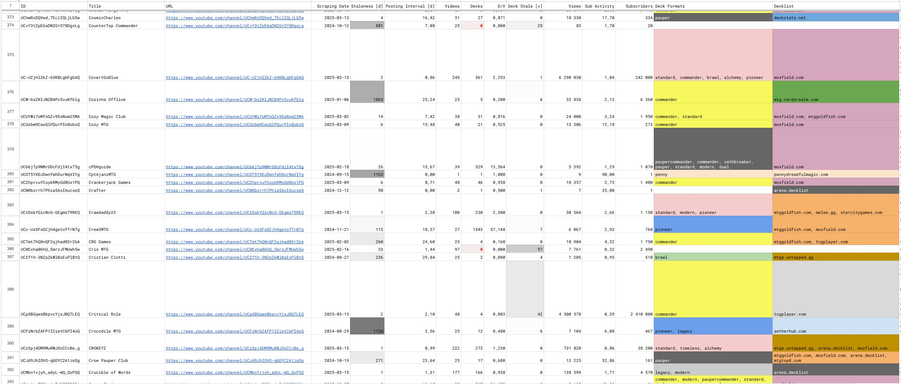

# mtg
Scrape data on MtG decks.

### Description

This is a hobby project.

It started as a card data scraping from `MTG Goldfish`. Then, some JumpIn! packets info scraping 
was added. Then, there was some play with Limited data from [17lands](https://www.17lands.com) when 
I thought I had to bear with utter boringness of that format (before the dawn of Golden Packs on 
Arena) [_This part has been deprecated and moved to [archive](https://github.com/z33kz33k/mtg/tree/2d5eb0c758953d38ac51840ed3e49c2c25b4fe91/mtgcards/archive) package_]. Then, I discovered I 
don't need to scrape anything because [Scryfall](https://scryfall.com).

Then, I quit (Arena).

Now, the main focus is `decks` package and `yt` module (parsing data on youtubers' decks from YT videos 
descriptions).

### What works

* Scryfall data management via downloading bulk data with 
  [scrython](https://github.com/NandaScott/Scrython) and wrapping it in convenient abstractions
* Scraping YT channels for videos with decklists in descriptions (or comments) - using no less than 
  four Python libraries to avoid bothering with Google APIs: 
    * [scrapetube](https://github.com/dermasmid/scrapetube),
    * [pytubefix](https://github.com/JuanBindez/pytubefix),
    * [youtubesearchpython](https://github.com/alexmercerind/youtube-search-python), 
    * [youtube-comment-downloader](https://github.com/egbertbouman/youtube-comment-downloader) 
* Scraping YT videos' descriptions (or comments) for decks:    
    * Text decklists in Arena/MTGO format pasted into video descriptions are parsed into Deck objects
    * Links to decklist services are scraped into Deck objects. 27 services are supported so far:
        * [Aetherhub](https://aetherhub.com)
        * [Archidekt](https://archidekt.com)
        * [CardBoard Live](https://cardboard.live)
        * [Cardhoarder](https://www.cardhoarder.com)
        * [Cardsrealm](https://mtg.cardsrealm.com/en-us/)
        * [Deckbox](https://deckbox.org)
        * [Deckstats.net](https://deckstats.net)
        * [Flexslot](https://flexslot.gg)
        * [Goldfish](https://www.mtggoldfish.com)
        * [Hareruya](https://www.hareruyamtg.com/en/)
        * [Manatraders](https://www.manatraders.com)
        * [ManaStack](https://manastack.com/home)
        * [Melee.gg](https://melee.gg)
        * [Moxfield](https://www.moxfield.com)
        * [MTGArena.Pro](https://mtgarena.pro)
        * [MTGAZone](https://mtgazone.com)
        * [MTGDecks.net](https://mtgdecks.net)
        * [MTGO Traders](https://www.mtgotraders.com/store/index.html)
        * [MTGTop8](https://mtgtop8.com/index)
        * [PennyDreadfulMagic](https://pennydreadfulmagic.com)
        * [Scryfall](https://scryfall.com)
        * [StarCityGames](https://starcitygames.com)
        * [Streamdecker](https://www.streamdecker.com/landing)
        * [TappedOut](https://tappedout.net)
        * [TCGPlayer](https://infinite.tcgplayer.com)
        * [TopDecked](https://www.topdecked.com)
        * [Untapped](https://mtga.untapped.gg) 
    * Other decklist services are in plans (but, it does seem like I've pretty much exhausted the 
      possibilities already :))
    * Both Untapped decklist types featured in YT videos are supported: regular deck and profile deck
    * Both old and new TCGPlayer sites are supported
    * Both international and native Hareruya sites are supported 
    * Sites that need it are scraped using [Selenium](https://github.com/SeleniumHQ/Selenium)
    * All those mentioned above work even if they are behind shortener links and need unshortening first
    * Text decklists in links to pastebin-like services (like [Amazonian](https://www.youtube.com/@Amazonian) does) work too
    * If nothing is found in the video's description, then the author's comments are parsed
    * Deck's name and format are derived if not readily available
    * Foreign cards and other that cannot be found in the downloaded Scryfall bulk data are looked 
      up with queries to the Scryfall API
    * Individual decklist URLs are extracted from container pages and further processed for decks. 
      These include:
        * Aetherhub users
        * Archidekt folders and users
        * Hareruya events
        * Moxfield bookmarks and users
        * MTGTop8 events
        * Streamdecker users
        * TappedOut users, folders, and user folders
        * others in plans
* Assessing the meta:
    * Scraping Goldfish and MGTAZone for meta-decks (others in plans)
    * Scraping a singular Untapped meta-deck decklist page
* Exporting decks into a [Forge MTG](https://github.com/Card-Forge/forge) .dck format or Arena 
  decklist saved into a .txt file - with autogenerated, descriptive names based on scraped deck's 
  metadata
* Importing back into a Deck from those formats
* Export/import to other formats in plans
* Dumping decks, YT videos and channels to .json
* I compiled a list of **over 1.2k** YT channels that feature decks in their descriptions and successfully 
  scraped them (at least 25 videos deep) so this data only waits to be creatively used now!

### How it looks in a Google Sheet

### Scraped decks breakdown
| No | Format | Count | Percentage |
|:---|:-----|------:|-----------:|
| 1  | commander       | 9439 |    31.16 % |
| 2  | standard        | 8408 |    27.76 % |
| 3  | modern          | 2558 |     8.45 % |
| 4  | legacy          | 1290 |     4.26 % |
| 5  | historic        | 1117 |     3.69 % |
| 6  | brawl           | 1025 |     3.38 % |
| 7  | pioneer         |  972 |     3.21 % |
| 8  | explorer        |  910 |     3.00 % |
| 9  | timeless        |  887 |     2.93 % |
| 10 | pauper          |  823 |     2.72 % |
| 11 | duel            |  776 |     2.56 % |
| 12 | undefined       |  742 |     2.45 % |
| 13 | premodern       |  284 |     0.94 % |
| 14 | alchemy         |  261 |     0.86 % |
| 15 | paupercommander |  224 |     0.74 % |
| 16 | irregular       |  144 |     0.48 % |
| 17 | standardbrawl   |  119 |     0.39 % |
| 18 | vintage         |  106 |     0.35 % |
| 19 | penny           |  103 |     0.34 % |
| 20 | oathbreaker     |   40 |     0.13 % |
| 21 | gladiator       |   36 |     0.12 % |
| 22 | oldschool       |   16 |     0.05 % |
| 23 | future          |   10 |     0.03 % |
|  | TOTAL           | 30290 | 100.00 %|

| No | Source | Count | Percentage |
|:---|:-----|------:|-----------:|
| 1  | moxfield.com           | 12295 |    40.59 % |
| 2  | aetherhub.com          |  4620 |    15.25 % |
| 3  | arena.decklist         |  4409 |    14.56 % |
| 4  | mtggoldfish.com        |  2328 |     7.69 % |
| 5  | archidekt.com          |  1440 |     4.75 % |
| 6  | mtgtop8.com            |   793 |     2.62 % |
| 7  | mtga.untapped.gg       |   764 |     2.52 % |
| 8  | streamdecker.com       |   763 |     2.52 % |
| 9  | tcgplayer.com          |   558 |     1.84 % |
| 10 | tappedout.net          |   537 |     1.77 % |
| 11 | melee.gg               |   295 |     0.97 % |
| 12 | mtgdecks.net           |   252 |     0.83 % |
| 13 | deckstats.net          |   237 |     0.78 % |
| 14 | hareruyamtg.com        |   177 |     0.58 % |
| 15 | scryfall.com           |   175 |     0.58 % |
| 16 | mtgazone.com           |   168 |     0.55 % |
| 17 | flexslot.gg            |   118 |     0.39 % |
| 18 | topdecked.com          |    77 |     0.25 % |
| 19 | pennydreadfulmagic.com |    74 |     0.24 % |
| 20 | manatraders.com        |    51 |     0.17 % |
| 21 | mtg.cardsrealm.com     |    41 |     0.14 % |
| 22 | manastack.com          |    38 |     0.13 % |
| 23 | deckbox.org            |    25 |     0.08 % |
| 24 | mtgarena.pro           |    23 |     0.08 % |
| 25 | cardhoarder.com        |    20 |     0.07 % |
| 26 | app.cardboard.live     |     9 |     0.03 % |
| 27 | old.starcitygames.com  |     2 |     0.01 % |
| 28 | mtgotraders.com        |     1 |     0.00 % |
|  | TOTAL                  | 30290 | 100.00 %|
